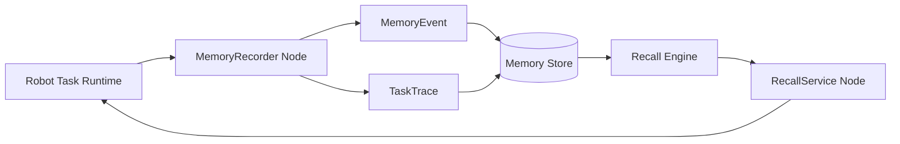
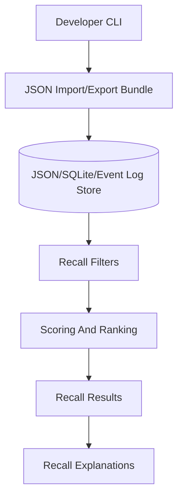
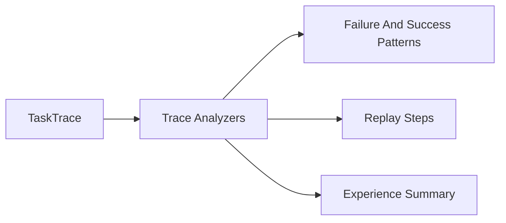

# Architecture Diagrams

## Runtime Memory Flow



## Persistence And Recall



## Trace Intelligence


# Architecture

`memory-aware-ros2-agent` is intended to provide a small memory layer for robot
workflows. The package will let robot nodes record what happened during a task,
persist those events as task traces, and recall relevant prior context before
future decisions.

## Phase 1 Scope

This phase only establishes the repository foundation:

- Python package structure
- Tooling for linting, typing, and tests
- Initial documentation
- Minimal import test

No ROS2 runtime code is included yet.

## Initial Components

```text
Robot Workflow
  |
  | emits task event data
  v
Memory Event API
  |
  | validates and normalizes events
  v
Task Trace Store
  |
  | persists ordered workflow history
  v
Recall Interface
  |
  | retrieves relevant prior context
  v
Robot Decision Layer
```

## Component Responsibilities

### Memory Event API

Accepts structured task events from robot workflows. Later phases should define
the event schema before adding ROS2-specific publishers or subscribers.

### Task Trace Store

Groups ordered events from a workflow into a trace that can be persisted,
inspected, and replayed for debugging.

### Recall Interface

Retrieves relevant prior events or traces when a robot workflow needs context
from previous attempts.

### Robot Decision Layer

Consumes recalled context. This package should provide memory context, not own
the robot's decision policy.

## Design Direction

The package should stay small and composable. ROS2 nodes, message definitions,
storage backends, and recall strategies should be added only when their
interfaces are clear from concrete workflow examples.

## Non-Goals For Foundation

- No ROS2 runtime nodes yet.
- No custom message definitions yet.
- No database or vector store dependency yet.
- No task planning or control policy implementation.
